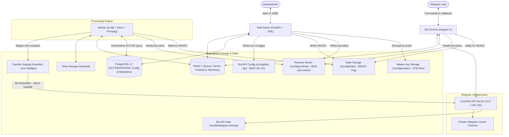

<div align="center">

# 🎬 Telegram YouTube Downloader

<p align="center">
  <b>A private, high-performance Telegram bot & web administration suite for downloading YouTube videos, MP3 audio, and multilingual subtitles with AI-powered translation.</b>
</p>

<p align="center">
  
  
  
  
  
  
</p>

</div>

---

## 📖 Overview

**Telegram YouTube Downloader** is a self-hosted solution that turns any Telegram chat into a private media downloader. Built with **aiogram 3**, **FastAPI**, **yt-dlp**, and **FFmpeg**, it provides a streamlined user experience, intelligent CPU optimization, and persistent cloud caching.

Unlike conventional downloaders that consume gigabytes of server storage, this system utilizes a **private Telegram channel as persistent media storage**. Completed media is uploaded once and cached forever; subsequent requests are delivered in milliseconds using Telegram's native `copyMessage` without consuming server CPU, RAM, or bandwidth.

---

## ✨ Features

- 🚀 **Production Local Bot API (2000 MB Uploads)**:
  - Runs self-hosted **Telegram Local Bot API Server 10.3** by default, lifting Telegram's 50 MB cloud limit to **2000 MB (2 GB)** single-file uploads.
  - **Zero-Multipart Local Handoff**: Completed media in `/transfer/<job-id>/` is handed directly to the Local Bot API server via `file:///transfer/...` URI, avoiding HTTP multipart stream overhead and RAM spikes.
  - **Cloud Fallback Mode**: Gracefully supports standard Cloud Bot API (`https://api.telegram.org`) with strict 50 MB preflight guard.
- 🎯 **Quality-First Telegram UX**:
  - Dynamically detects actual available resolutions directly from YouTube streams (`2160p`, `1440p`, `1080p`, `720p`, `480p`, `360p`).
  - Previews send the video thumbnail with only the **Video Title** as caption.
  - Initial menu presents source resolutions, `🎵 MP3`, and `💬 Subtitle`.
- 🔒 **Strict Exact Resolution**:
  - Enforces exact requested height (`height == requested_height`). Never silently downgrades or upgrades quality.
- 🎬 **Two-Step Codec Selection**:
  - Resolution is selected first, followed by clean options: `🎬 H.264 / AAC`, `📦 H.265 / AAC`, and `⬅️ Back`.
- ⚡ **Zero Unnecessary Transcoding (CPU Optimized)**:
  - Probes streams with `ffprobe` and prefers stream copying (`-c copy`) whenever the source already matches target codecs. Runs smoothly on minimal 1-2 core VPS instances.
- ☁️ **Private Telegram Cache**:
  - Persistent storage in a private Telegram channel. Cache hits bypass workers and queues entirely.
- 🧹 **Zero Permanent Disk Waste**:
  - Temporary files are automatically purged after verified cache upload, failure, or cancellation.
- 🛡️ **Authoritative Must-Join Channel Guard**:
  - Optionally require users to join specific Telegram channels before granting access. Customizable template message with `{first_name}` and `{channel_list}` placeholders.
- 🚦 **Persistent Queue & Concurrency Control**:
  - Redis-backed FIFO queue surviving container restarts.
  - Race-safe concurrency slot allocation via Redis Lua scripts.
  - Real-time derived queue positions for users (`#1`, `#2`...).
- 👥 **Duplicate Job Coalescing**:
  - Multiple users requesting the same video share a single underlying processing job and queue slot.
- 💬 **Subtitles with AI Translation**:
  - Clean English SRT extraction (auto-generated or manual).
  - Persian AI subtitle translation using any OpenAI-compatible API endpoint with strict timestamp preservation.
- 🍪 **YouTube Cookies Manager**:
  - Upload or paste `cookies.txt` with Netscape format validation, atomic write, and hot-reload.
- 🔐 **Least-Privilege Security Architecture & State Invariants**:
  - **Worker isolation**: Worker has no access to `master.key` or PostgreSQL decryption; reads `bot-token` strictly from a restricted Unix group runtime volume (`0640`, group `ytdl-runtime` GID 1001) with zero `.env` credential fallback.
  - **Universal readiness gating**: Both Bot Service long-polling and Worker job dequeuing strictly gate on `/config/state/READY`. If `READY` is absent during reconciliation or mutations, services idle safely.
  - **Non-blocking session advisory lock**: `pg_try_advisory_lock(73541629)` on a dedicated session connection with explicit autobegin rollback prevents concurrent configuration collisions with instant HTTP 409 Conflict.
  - **Cloud ➔ Local migration state machine**: Dedicated `telegram_migrations` singleton table (`CHECK (id = 1)`) manages non-atomic cloud `logOut()`. Categorizes timeouts, HTTP 429, and 5xx as `CLOUD_LOGOUT_UNKNOWN`, respecting Telegram's 10-minute cooldown.
  - **Authoritative configuration reads**: Worker and Bot query `Setting` records directly from PostgreSQL for every job/poll, backed by Redis Pub/Sub invalidation and a 30-second drift heartbeat.
  - **Strict 5-step cache channel validation**: Probes channel eligibility via `getChat` and `getChatAdministrators` checking `can_post_messages` without intrusive `sendChatAction` calls.
  - **Service-reported telemetry**: Worker and Local Bot API report disk metrics into Redis; no cross-service storage volume mounts into Web Admin.
- 🖥️ **Full Web Administration Panel**:
  - Modern, responsive dashboard on port `8085` protected by Argon2id authentication.
  - Interactive Telegram Configuration panel with live API testing, derived endpoints, and zero-downtime hot reloading.

---

## 📱 User Experience Flow

```
User sends YouTube URL
        │
        ▼
[ Must-Join Channel Guard ] ──(Missing channel)──> [ Join Required Channels ]
        │ (Authorized)
        ▼
[ Metadata Extraction & Duration Check ]
        │
        ▼
[ Thumbnail Photo Preview ]
Caption: VIDEO TITLE ONLY
┌─────────────┬─────────────┐
│    1080p    │    720p     │
├─────────────┼─────────────┤
│    480p     │    360p     │
├─────────────┼─────────────┤
│   🎵 MP3    │ 💬 Subtitle │
└─────────────┴─────────────┘
        │
        ▼ User selects "1080p"
[ Seamless Menu Edit ]
┌───────────────────────────┐
│      🎬 H.264 / AAC       │
├───────────────────────────┤
│      📦 H.265 / AAC       │
├───────────────────────────┤
│          ⬅️ Back          │
└───────────────────────────┘
        │
        ▼ User selects codec
[ Cache Lookup ] ──(Cache Hit)──> [ Instant copyMessage Delivery ]
        │ (Cache Miss)
        ▼
[ Redis Persistent FIFO Queue ] ──> [ Live Status Message (⬇️ Downloading 64%...) ]
        │
        ▼
[ FFmpeg Processing (Stream-Copy or Transcode) ]
        │
        ▼
[ Upload to Private Telegram Cache Channel ]
        │
        ▼
[ Deliver to User(s) & Delete Local Temp File ]
```

---

## 🏗️ System Architecture



### 🔐 Telegram Runtime Consistency & State Invariants

The Telegram integration is engineered around strict operational consistency and least-privilege security invariants:

1. **The `/config/state/READY` Invariant**:
   - **File presence guarantees consistency**: The presence of `/config/state/READY` guarantees that filesystem runtime artifacts strictly match the authoritative `ACTIVE` configuration in PostgreSQL (`config_version = N`).
   - **Universal consumer gating**: Both **Bot Service** (long-polling loop) and **Worker** (job dequeuing in `acquire_next_job()`) check for the existence of `READY`.
   - **Graceful pause**: If `READY` is unlinked during reconciliation, ordinary mutations, or migrations, Bot polling and Worker job acquisition safely idle without crashing or dropping state.

2. **Least-Privilege Credential Isolation**:
   - **Filesystem Permissions**: The runtime bot token `/config/runtime/bot-token` is generated by Web Admin with mode `0640`, owned by Web Admin runtime user and Unix group `ytdl-runtime` (GID `1001`).
   - **Zero Secret Fallback**: Worker and Bot run with supplementary GID `1001` and read the bot token strictly from this volume. Neither service has access to `master.key` or PostgreSQL decryption keys, and production builds strictly disallow `.env` secret fallbacks.

3. **Dual Mutation Lifecycles**:
   - **Ordinary Mutations (Bot Token / Cache Channel / Limits)**:
     1. TX1 validates syntax and creates candidate `PENDING` configuration.
     2. Candidate credentials and channel permissions are verified against Telegram API while `ACTIVE` remains live.
     3. `/config/state/READY` is unlinked.
     4. TX2 atomically commits `ACTIVE = N+1` and clears `PENDING`.
     5. Web Admin writes runtime token and verifies runtime artifacts.
     6. `/config/state/READY` is restored and change notification is published to Redis.
   - **Design B Local Bot API Mutations (Port / Host / Worker Handoff)**:
     1. TX1 validates and creates `PENDING`.
     2. `/config/state/READY` is unlinked *before* modifying Local Bot API configuration, as the Local Bot API server must be restarted to test candidate settings.
     3. Candidate `local-bot-api.env` is written and `restart-trigger` is touched.
     4. Health check probes candidate Local Bot API instance until responsive.
     5. TX2 atomically commits `ACTIVE = N+1`.
     6. Web Admin verifies runtime artifacts and restores `/config/state/READY`.

4. **Session-Level Non-Blocking Advisory Locking**:
   - Web Admin acquires `pg_try_advisory_lock(73541629)` on a dedicated connection to prevent concurrent admin configuration modifications, returning HTTP 409 Conflict immediately on contention.
   - Because SQLAlchemy 2.0 `conn.scalar()` automatically opens an implicit transaction block (autobegin), an explicit `await conn.rollback()` is executed immediately after acquiring the lock. This clears the transaction block while retaining the session-level lock, ensuring long-running external HTTP probes do not hold open an idle PostgreSQL transaction.

5. **Cloud ➔ Local Migration State Machine**:
   - Switching from Cloud Bot API to Local Bot API requires calling Telegram's Cloud `logOut()`, which terminates the bot's cloud session and initiates a mandatory **10-minute cooldown** before that token can return to Cloud.
   - Managed via a dedicated `telegram_migrations` singleton table (`CHECK (id = 1)`):
     - `IDLE`: Normal operation.
     - `CLOUD_LOGOUT_IN_PROGRESS`: `logOut()` request in flight to `api.telegram.org`.
     - `CLOUD_LOGOUT_SUCCEEDED`: HTTP 200 (`ok=true, result=true`) confirmed. Local Bot API validation begins.
     - `CLOUD_LOGOUT_UNKNOWN`: Ambiguous outcome caused by network drop, socket timeout, HTTP 429 (Rate Limit), or HTTP 5xx.
     - `LOCAL_VALIDATION_FAILED`: `logOut()` succeeded, but Local Bot API validation failed.
   - **Disaster Recovery**: Under `CLOUD_LOGOUT_UNKNOWN` or `LOCAL_VALIDATION_FAILED`, `/config/state/READY` remains unlinked, automatic retries or rollbacks are blocked, and `getMe()` is never used as an oracle (as `getMe()` tests token validity, not session logout state). The administrator is notified via the Web Admin UI to inspect the 10-minute cooldown timer and resolve manually.

6. **Strict 5-Step Cache Channel Validation**:
   - Channel verification executes five non-intrusive Telegram API calls: `getChat`, `getChatAdministrators`, checks administrator status, verifies `can_post_messages` permission bit, and confirms chat type is `channel` or `supergroup`.
   - Never invokes intrusive `sendChatAction` calls.

7. **Authoritative Configuration Reads & Resilient Uploads**:
   - The Worker queries `Setting` records directly from PostgreSQL for each job execution (mode, channel ID, configuration version).
   - Local Bot API zero-multipart uploads feature a 3-attempt exponential retry loop to gracefully withstand transient connection resets during Local Bot API restarts.

---

## ⚙️ Minimum Hardware Requirements

| Component | Minimum | Recommended | Notes |
|---|---|---|---|
| **CPU** | 1 Core | 2 Cores | `MAX_ACTIVE_JOBS=1` default ensures stability |
| **RAM** | 1 GB | 2 GB – 4 GB | Combined memory consumption is under 800 MB |
| **Storage** | 10 GB | 20 GB – 50 GB | Completed media is stored in Telegram cache |
| **OS** | Linux | Debian / Ubuntu / Alpine | Any Docker-supported distribution |

---

## 🚀 Quick Start & Deployment

### 1. Prerequisites
1. **Telegram Bot Token**: Create a bot via [@BotFather](https://t.me/BotFather).
2. **Private Cache Channel**:
   - Create a private channel in Telegram.
   - Add your bot as an **Administrator** with full posting permissions.
   - Retrieve the numeric channel ID (e.g., `-1001234567890`) using [@JsonDumpBot](https://t.me/JsonDumpBot) or [@username_to_id_bot](https://t.me/username_to_id_bot).
3. **Telegram API Credentials**: Get `TELEGRAM_API_ID` and `TELEGRAM_API_HASH` from [my.telegram.org](https://my.telegram.org).

---

### Option A: Deploy via Portainer (Recommended)

1. Open Portainer and navigate to **Stacks** -> **Add stack**.
2. Select **Repository** and enter:
   - **Repository URL**: `https://github.com/musicOverdose/youtubedl.git`
   - **Repository reference**: `refs/heads/main`
   - **Compose path**: `docker-compose.yml`
3. In the **Environment variables** section, define:
   ```env
   BOT_TOKEN=your_telegram_bot_token
   TELEGRAM_API_ID=your_api_id
   TELEGRAM_API_HASH=your_api_hash
   TELEGRAM_CACHE_CHANNEL_ID=-1001234567890
   WEB_PORT=8085
   ADMIN_USERNAME=admin
   ADMIN_PASSWORD=SetAStrongPasswordHere
   SECRET_KEY=generate_a_random_64_character_string
   MAX_ACTIVE_JOBS=1
   MAX_VIDEO_DURATION_SECONDS=7200
   ```
4. Click **Deploy the stack**.

---

### Option B: Deploy via Docker Compose CLI

```bash
# 1. Clone repository
git clone https://github.com/musicOverdose/youtubedl.git
cd youtubedl

# 2. Setup configuration
cp .env.example .env
nano .env

# 3. Launch stack
docker compose up -d --build

# 4. View real-time logs
docker compose logs -f
```

---

## 🎛️ Web Administration Panel

Access the dashboard at `http://<your-server-ip>:8085`.

```
┌─────────────────────────────────────────────────────────────┐
│ ⚡ YTDL Management Console                                   │
├───────────────┬─────────────────────────────────────────────┤
│ 📊 Dashboard  │ Live CPU, RAM, Disk, Active & Queued counts │
│ ⏳ Queue      │ Live progress bars, speed, ETA, Pause/Resume│
│ 📁 Jobs       │ Filterable job history, retry & cancel      │
│ ⚡ Cache       │ Inspect cached items, hit stats, delete     │
│ 👥 Users      │ User list, job statistics, ban/unban        │
│ 🔒 Must Join  │ Enforce channel membership, bot status test │
│ 📺 YouTube    │ Default resolutions, playlist limits        │
│ 🍪 Cookies    │ Netscape cookies.txt upload, paste, test    │
│ 🤖 AI Trans   │ OpenAI-compatible subtitle translation      │
│ ⚙️ Settings   │ Video duration limit, safety controls       │
│ 🖥️ System     │ Service health, Prometheus /metrics         │
│ 📝 Logs       │ Real-time structured system logs            │
│ 🛡️ Audit Log  │ Security audit trail of admin actions       │
└───────────────┴─────────────────────────────────────────────┘
```

---

## 🔧 Environment Variables Reference

| Variable | Default | Description |
|---|---|---|
| `BOT_TOKEN` | *Required* | Telegram Bot token from @BotFather |
| `TELEGRAM_API_ID` | *Required* | Telegram App ID from my.telegram.org |
| `TELEGRAM_API_HASH` | *Required* | Telegram App Hash from my.telegram.org |
| `TELEGRAM_CACHE_CHANNEL_ID` | *Required* | Channel ID for permanent media cache |
| `TELEGRAM_API_BASE_URL` | `https://api.telegram.org` | Bot API URL (or local bot API server) |
| `WEB_PORT` | `8085` | Web administration panel port |
| `ADMIN_USERNAME` | `admin` | Administrator login username |
| `ADMIN_PASSWORD` | `admin123` | Initial administrator login password |
| `SECRET_KEY` | *Auto* | Secret key for signing session tokens |
| `MAX_ACTIVE_JOBS` | `1` | Global concurrent processing limit |
| `MAX_CONCURRENT_PER_USER` | `1` | Max concurrent jobs per user |
| `MAX_VIDEO_DURATION_SECONDS`| `7200` | Max video duration (default 2 hours) |
| `ALLOW_UNKNOWN_DURATION` | `false` | Reject videos with unknown length |
| `CACHE_HIT_BYPASSES_DURATION_LIMIT` | `true` | Deliver cached videos even if over duration limit |
| `MAX_TEMP_STORAGE_GB` | `30` | Safety limit for temporary storage |
| `DEFAULT_MAX_HEIGHT` | `1080` | Default maximum video resolution |
| `PLAYLISTS_ENABLED` | `false` | Enable/disable playlist downloads |
| `AI_ENABLED` | `false` | Enable Persian AI translation |
| `AI_PROVIDER` | `openai` | AI translation provider |
| `AI_BASE_URL` | `https://api.openai.com/v1` | OpenAI-compatible endpoint |
| `AI_MODEL` | `gpt-4o-mini` | Model for subtitle translation |

---

## 💾 Backup Guidelines

| Asset | Backup Required? | Description |
|---|---|---|
| **PostgreSQL Database** | **YES** | Contains user history, channel configs, cache records, and audit logs |
| **Environment Configuration** | **YES** | `.env` credentials and configuration |
| **Media Files** | **NO** | Completed media is permanently preserved in the private Telegram cache channel |

### Automated Database Backup (Cron Example)
```bash
0 3 * * * docker exec ytdl_postgres pg_dump -U ytdl_user ytdl_db | gzip > /backups/ytdl_db_$(date +\%F).sql.gz
```

---

## 🧪 Testing

The repository contains a comprehensive 53-test automated test suite:

```bash
# Run complete test suite:
pytest -v
```

Tests cover:
- **Telegram Dual-Mode & Zero-Multipart Transfer**:
  - Direct local handoff via `file:///transfer/...` URI in Local mode
  - Strict 50 MB preflight rejection and `FSInputFile` usage in Cloud mode
  - Dynamic endpoint derivation (`http://telegram-bot-api:8081` vs `https://api.telegram.org`)
  - Staged directory cleanup on startup and post-upload
  - Worker 3-attempt upload retry loop on transient Local Bot API connection resets
- **Non-Blocking Advisory Locking & Transaction State Machine**:
  - `pg_try_advisory_lock(73541629)` immediate HTTP 409 Conflict under concurrency
  - Explicit rollback of SQLAlchemy 2.0 autobegin clearing implicit transactions while retaining session lock
  - Short Transaction 1 (create `PENDING`), external validation probes, Short Transaction 2 (promote to `ACTIVE`)
  - Automatic rollback on TCP/probe failure, restoring candidate env files and deleting `PENDING`
  - Startup reconciliation and universal readiness gating (`/config/state/READY`) for Bot and Worker
- **Cloud ➔ Local Migration State Machine & Database Invariants**:
  - Dedicated `telegram_migrations` singleton table enforcing `CHECK (id = 1)`
  - State machine lifecycle transitions: `IDLE`, `CLOUD_LOGOUT_IN_PROGRESS`, `CLOUD_LOGOUT_SUCCEEDED`, `CLOUD_LOGOUT_UNKNOWN`, `LOCAL_VALIDATION_FAILED`
  - Strict classification of timeouts, network disconnects, HTTP 429, and 5xx as `CLOUD_LOGOUT_UNKNOWN`
  - Real PostgreSQL 17 integration testing for migration state transitions, advisory locks, and channel validations
- **Service-Reported Telemetry**:
  - Worker disk telemetry reporting (`/tmp/ytdl` and `/transfer` usage to Redis)
  - Telegram Local Bot API telemetry reporting (`/var/lib/telegram-bot-api` usage to Redis)
  - System service aggregation and least-privilege storage boundary validation
- **Security & Secret Management**:
  - Fernet master key generation fail-safe against pre-existing encrypted PostgreSQL rows
  - Secret masking and log redaction for `/bot<token>/` and 32-hex API hashes
  - Strict Unix file permission enforcement (`0640` group `ytdl-runtime`, `0640` GID 101, `0644` state)
  - No secret fallback to `.env` in production Bot or Worker environments
  - Argon2id password hashing and session token verification
- **Media Processing & Business Logic**:
  - Dynamic quality extraction & descending order
  - Stream copy vs. transcoding decision logic (zero unnecessary transcode)
  - Subtitle normalization & strict SRT validation
  - Deterministic cache key generation & cache invalidation
  - Redis FIFO queue ordering & derived position calculation
  - Concurrency race-safety with atomic Lua scripts
  - Authoritative Must-Join channel checks & customizable template rendering
  - Cookie Netscape format validation & atomic file writes

---

## 📄 License

This project is licensed under the [MIT License](LICENSE).
